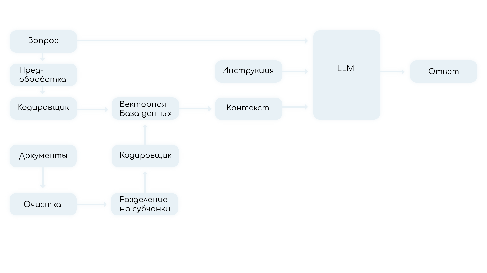

# RAG Чатбот Центрального Банка России

## О проекте

Проект "RAG Модель Центрального Банка России" разработан командой POST ИИрония для Центрального Банка России. Цель проекта - создание RAG (Retriever-Reader) чатбота, способного обрабатывать запросы пользователей на русском языке и предоставлять информацию на основе документации Центрального Банка.

## Ключевые особенности

- Использует RAG модель для поиска и предоставления информации из документации Центрального Банка.
- Обрабатывает запросы пользователей и предоставляет соответствующие ответы.
- Предоставляет доступ к большому объему информации Центрального Банка.

## Команда

- **Чесников Леонид** - Ai-Engineer & Project-manager
- **Овчинников Алексей** - Backend
- **Тронев Алексей** - Design
- **Сорокина Александра** - Frontend
- **Борис Карабут** - Frontend

## Использование

1. Задать вопрос чатботу, используя блокноты или API.
2. Получить ответ от чатбота, основанный на запросе и информации из документации Центрального Банка России.

## Контакты

Если у вас есть вопросы или предложения по проекту, обращайтесь к членам нашей команды:

- [**Чесников Леонид**](https://github.com/RebelRaider) (Ai-Engineer & Project-manager)
- [**Овчинников Алексей**](https://github.com/allelleo) (Backend)
- [**Тронев Алексей**](https://github.com/slund3r) (Design)
- [**Сорокина Александра**](https://github.com/SupPicaPica) (Frontend)
- [**Борис Карабут**](https://github.com/RoastedPikachu) (Frontend)

## Лицензия

Проект распространяется под лицензией [MIT](LICENSE).
